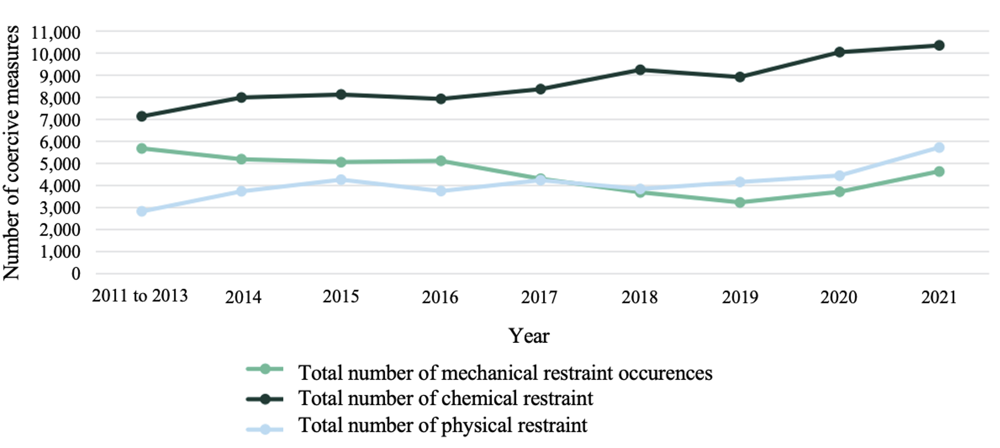
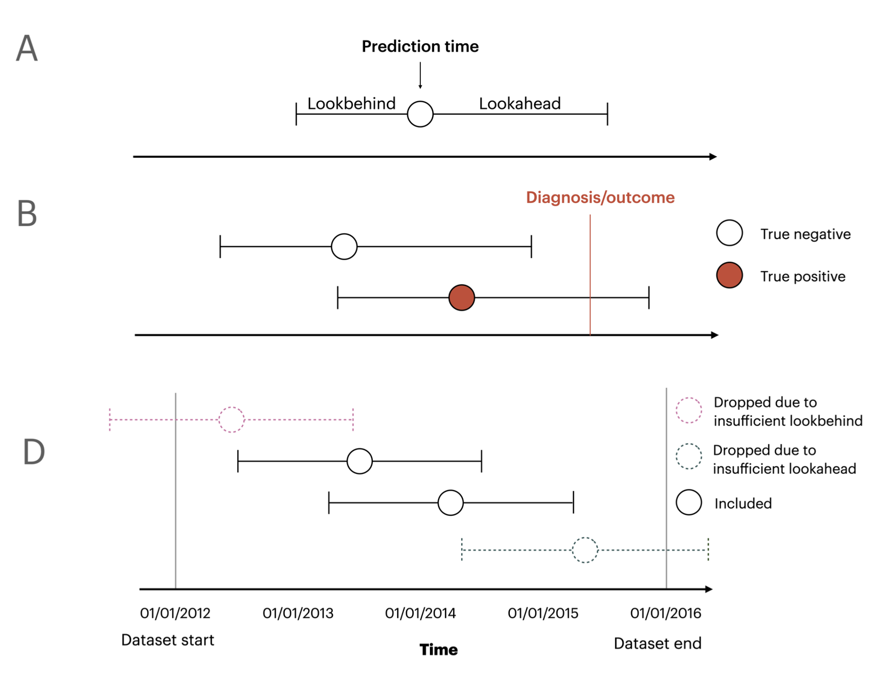
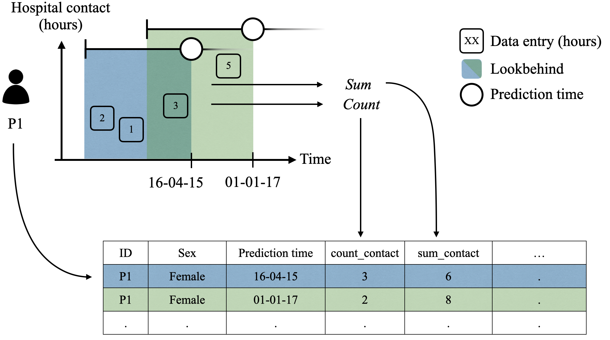
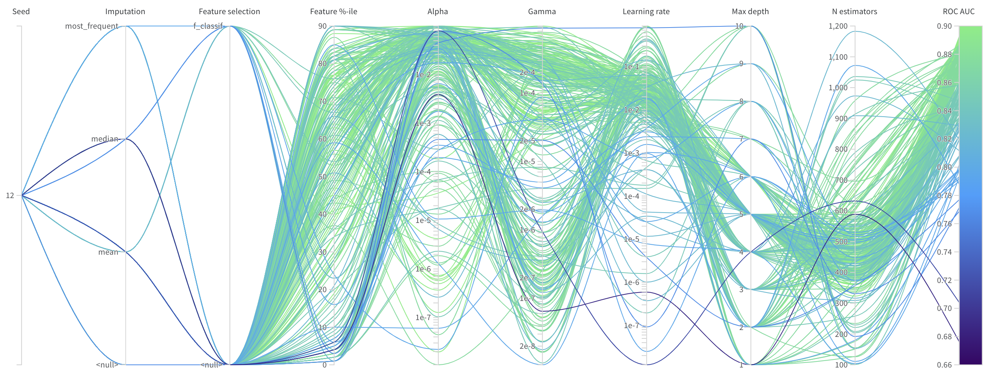
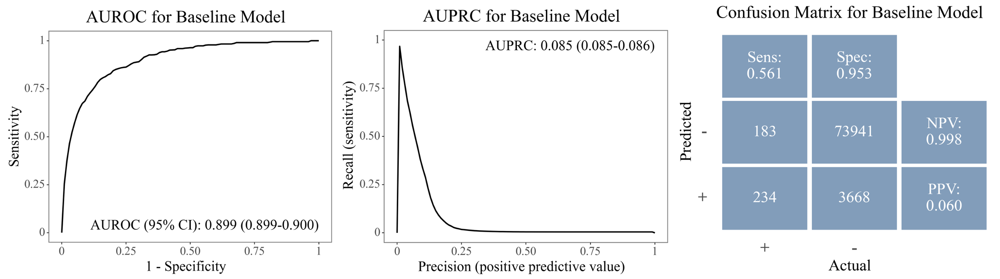
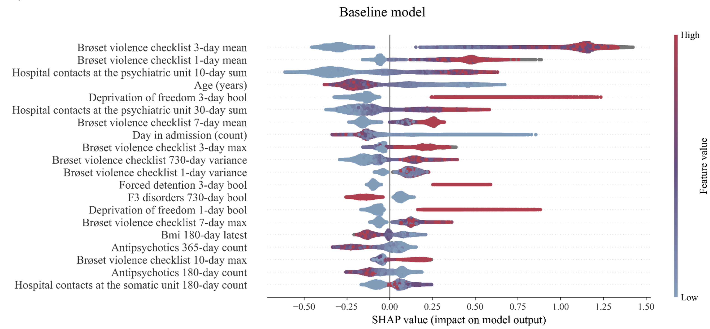

<a href="https://github.com/Aarhus-Psychiatry-Research/CARE-ML"></a>


[][black]
[][tests]

[pypi status]: https://pypi.org/project/CARE-ML/
[tests]: https://github.com/Aarhus-Psychiatry-Research/psycop-common/actions?workflow=Tests
[black]: https://github.com/psf/black

# CARE-ML: Predicting use of restraint on psychiatric inpatients using electronic health data and machine learning

This repository was developed as a part of the product Master’s Thesis in Cognitive Science by: 

Signe Kirk Brødbæk (201707519) and Sara Kolding (201708816)

## Table of Contents 
[1. Motivation](#motivation)

[2. Terminology](#terminology)

[3. Installation](#installation)

[4. Project Organization](#project_organisation)

[4.1. Cohort Generation](#mod1)

[4.2. Feature Generation](#mod2)

[4.3. Model Training](#mod3)

[4.4. Model Evaluation ](#mod4)


 <a id="motivation"></a>
## 1. Motivation
The use restraint, has been increasing in Danish psychiatric units, despite the objective from the Ministry of Health and the Danish Regions to decrease the use of coercive measures in Danish psychiatric units (see the figure below). In recent years, the literature on machine learning (ML) and prognostic prediction models in clinical contexts has expanded, including studies identifying individual patients at high risk of being restrained (Danielsen et al., 2019). By offering early detection of at-risk patients, such models can enable staff to reallocate resources to a subgroup of patients, to avoid the use of coercive interventions.
   


In our thesis, we built a pipeline for training and evaluating prognostic supervised ML models for predicting the use of restraint on inpatients in the Central Denmark Region (CDR), building upon the study by Danielsen et al. (2019). We use electronic health record (EHR) data, and utilise the frameworks of the [timeseriesflattener](https://github.com/Aarhus-Psychiatry-Research/timeseriesflattener) package and the code base for the PSCYOP projects [psycop-common](https://github.com/Aarhus-Psychiatry-Research/psycop-common). The resulting package, **C**oercion **A**nd **R**estraint in **E**HRs using **ML** (_CARE-ML_), is intended for researchers in the CDR, to further develop and fine-tune tools for prognostic modelling of coercion in psychiatry.

We focused on building a tool that is interpretable and transparent, including evaluations to examine the relationship between the most important features and the outcome, as well as potential biases. Due to the sensitivity of the data infrastructures utilised in these projects, the packages are designed for very specific use cases within the department of psychiatry in the CDR. As a consequence, the pipeline is intended for a small target audience, and can be utilised and adapted for future research by researchers in the CDR. However, the framework and considerations implemented in this pipeline, such as the definition of temporal aspects and external validation, is generalisable and can be utilised in other ML contexts. 

In the following sections, we will present 2) the core terminology used, 3) how to install the package, 4) the project organisation, and the functionality within each of module which allows for flexible and customisable pipelines in future research. 

<a id="terminology"></a>
## 2. Terminology
We adopt the terminology used in the [timeseriesflattener](https://github.com/Aarhus-Psychiatry-Research/timeseriesflattener) package, which includes _lookbehind and lookahead windows_, and _aggregation functions_. 

### Lookahead and lookbehind windows 
The prediction time describes the time of prediction and acts as the reference point for the lookbehind and lookahead windows. The lookbehind window denotes how far back in time to look for feature values, while the lookahead window denotes how far into the future to look for outcome values.



_Note. Visualisation of the timeseriesflattener terminology adapted from Bernstoff et al. (2023), reprinted with permission from the original authors._

In the current project, we utilise lookbehind windows of varying lengths (between 1 day and 730 days) to create features. The labels were created with a lookahead of 2 days/48 hours. 

<a id="aggf"></a>
### Aggregation functions
The figure below denotes how features can be "flattened" when multiple data entries exist within a lookbehind window. In the blue lookbehind, the three suicide risk assessments are completed and logged. These entries are aggregated into a tabular format by counting the number of risk scores and summing scores. Similarly, two scores appear in the green lookbehind window, which is also aggregated as the count of risk scores and the sum of scores. 



_Note. Figure developed in collaboration with the PSYCOP group._

<a id="installation"></a>
## 3. Installation

To install this repository: 

1) Clone the repository 
```
git clone https://github.com/Aarhus-Psychiatry-Research/CARE-ML.git
```
2) Install the package and its dependencies from the project root: 
```
python -m pip install -e .
```
3) Install psycop-common as source
    _(depending on your terminal, you might need to add '' around .[scr]: `python -m pip install -e '.[src]'`)_:
```
python -m pip install -e .[src]
```
4) For contributions to package development, install timeseriesflattener and psycop-common in your 'src' folder as their own repositories:
```
pip install --src ./src -r src-requirements.txt
```

<a id="project_organisation"></a>
## 4. Project Organization

The project consists of four modules for 1) cohort generation, 2) feature generation, 3) model training, and 4) model evaluation. In the following sections, we will delineate the functionality of each module. 

    ├── README.md
    │
    ├── docs
    │
    ├── src                      <- Source code for use in this project
    │   ├── __init__.py          
    │   │
    │   ├── cohort_generation    <- Module for creating the cohort wih labels
    │   │
    │   ├── feature_generation   <- Module for feature generation
    │   │
    │   ├── model_evaluation     <- Module for model evaluation
    │   │
    │   ├── model_training       <- Module for model training
    │
    ├── pyproject.toml           <- toml file handling all package dependendencies
    │ 
    └── Other configuration files

<a id="mod1"></a>
### 4.1. Cohort Generation 

First, the cohort was defined with the following inclusion/exclusion criteria: 

1. The patient had a minimum of one psychiatric admission which started between 1 January 2015 and 22 November 2021.
2. The patient was >= 18 years at the time of admission.
3. The patient experienced no instances of physical, chemical, or mechanical restraint in the 365 days before the admission start date. 

Then, target days were defined as: 

1. Either physical, chemical, or mechanical restraint occuring within 48 hours of the time of prediction
3. Days after the first outcome instance was excluded since only 11.68% of admission with coercion in the PSYCOP cohort have only one instance of restraint, and predicting days after the first outcome offers less information to healthcare professionals. 
4. Prediction days after mean admission length + 1 standard deviation (mean = 16 days, sd = 44 days, cut-off = 60 days) was excluded to remedy the imbalance in classes.

The specific values of these criteria can be changed for further tuning of hyperparameters in future research.

In this module, admissions start out as being one row and is unpacked to include 1 row per day in the admission with the prediction time, excluding the first admisison day if it is after the prediction time of the current day and the last admission day if the patient is discharged before the time of prediction.

See example below with the unpacking of an admission, where the time of prediction 6:00 a.m. and lookahead is 48 hours.  

Note: 
- The fifth/last day of admisision is removed, since days after the outcome is removed.
- Since the lookahead is 48 hours, two days are denoted target days.

Before: 
| adm_id | patient_id | admission_timestamp | discharge_timestamp |  outcome_timestamp   |
| :----- | :--------- | :------------------ | :------------------ |  :-----------------  |
| 1      |     1      | 2021-01-01 05:00:00 | 2021-01-05 16:00:00 |  2021-01-04 16:33:00 |


After: 
| adm_id | patient_id | admission_timestamp | discharge_timestamp |  outcome_timestamp   | prediction_timestamp | admission_day_counter | target | 
| :----- | :--------- | :------------------ | :------------------ |  :-----------------  | :------------------- | :-------------------- | :-----  |
| 1      |     1      | 2021-01-01 05:00:00 | 2021-01-05 16:00:00 |  2021-01-04 16:33:00 | 2021-01-02 06:00:00  |  1                    |  0      |
| 1      |     1      | 2021-01-01 05:00:00 | 2021-01-05 16:00:00 |  2021-01-04 16:33:00 | 2021-01-02 06:00:00  |  2                    |  0      |
| 1      |     1      | 2021-01-01 05:00:00 | 2021-01-05 16:00:00 |  2021-01-04 16:33:00 | 2021-01-03 06:00:00  |  3                    |  1      |
| 1      |     1      | 2021-01-01 05:00:00 | 2021-01-05 16:00:00 |  2021-01-04 16:33:00 | 2021-01-04 06:00:00  |  4                    |  1      |

<a id="mod2"></a>
### 4.2. Feature Generation

In this module, the cohort is linked to other variables to create features based on the defined lookbehind windows and aggregation functions, using the _timeseriesflattener_ package and data loaders from the _psycop-common_ package. 

_timeseriesflattener_ was created to handle data from EHRs, which might have many missing values and are sampled irregularly. By defining windows to look for values and how such values should be aggregated, _timeseriesflattener_ *flattens* the data, as described in Section [2. Terminology](#terminology). 

In addition to aggregation functions, a _fallback_, i.e. a value to insert when no observations is found within a window, is chosen. We used fallbacks of 0 (e.g., for hospital contacts) and NA (for texts and structured SFI's where a 0 score is different from a missing value). 

If we use the example in the figure for aggregation function in [Section 2](#aggf), the lookbehind window is 2 days, with three suicide risk assessment scores within the first (blue) lookbehind and two risk scores within the second (green) lookbehind. The data entries can be aggregated in multiple ways. Here, we aggregate them by counting the number of contacts and summing the hours of contacts. The fallback is set to NA, since a score of 0 is meaningful for this feature. 

The features are appended on the cohort dataframe with one admission from the previous example: 

Suicide risk assessment dataframe: 
| patient_id | risk_timestamp      | Score  |  
| :--------- | :------------------ | :----- | 
|     1      | 2020-12-30 10:00:00 | 2 |
|     1      | 2021-12-30 10:00:00 | 0 |
|     1      | 2021-12-31 10:00:00 | 2 |
|     1      | 2021-01-01 10:00:00 | 3 |


Appended to the cohort dataframe: 
| adm_id | patient_id | admission_timestamp | discharge_timestamp |  outcome_timestamp   | prediction_timestamp | admission_day_counter | outcome | pred_risk_within_2_days_count | pred_risk_within_2_days_sum |
| :----- | :--------- | :------------------ | :------------------ |  :-----------------  | :------------------- | :-------------------- | :-----  | :---- | :---- |
| 1      |     1      | 2021-01-01 05:00:00 | 2021-01-05 16:00:00 |  2021-01-04 16:33:00 | 2021-01-01 06:00:00  |  1                    |  0      | 3     |   3   |
| 1      |     1      | 2021-01-01 05:00:00 | 2021-01-05 16:00:00 |  2021-01-04 16:33:00 | 2021-01-02 06:00:00  |  2                    |  0      | 2     |   5   |  
| 1      |     1      | 2021-01-01 05:00:00 | 2021-01-05 16:00:00 |  2021-01-04 16:33:00 | 2021-01-03 06:00:00  |  3                    |  1      | 1     |   3   |
| 1      |     1      | 2021-01-01 05:00:00 | 2021-01-05 16:00:00 |  2021-01-04 16:33:00 | 2021-01-04 06:00:00  |  4                    |  1      | 0     |   0   |

In this module, a variety of loaders (loading data from the data infrastructure used in CDR, for users with access) can be utilised. Among others, it is possible to create features based on demographics, medication, coercion, hospital contacts, and assessment scores ("Sundhedsfagligt Indhold, SFIs). Features based on unstructured text can also be created with this module. 

For the thesis project, we created two feature sets using this module: 
- A _baseline_ feature set solely consisting of features based on structured data 
- A _text-enhanced_ feature set consisting of features based on Bag-of-Words and TF-IDF* weighting, in addition to the baseline features

The data was split into a 85% training dataset and a 15% held-out test set. 

*TF-IDF: Term frequency-inverse document frequency 

<a id="mod3"></a>
### 4.3. Model Training 

We used two model types: elastic net logistic regression and XGBoost. Both were trained using 5-fold cross-validation, with a hyperparameter search including tuning of various preprocessing parameters, feature selection methods, and model hyperparameters. 
The search was run on a server 30-core Intel Xeon CPU, 512GB of RAM and an NVIDIA A100 GPU, and was concluded when each of the four models had been cross-validated 300 times with various configurations of hyperparameters. 
It would not be feasible to run such a search on a local computer. However, it is possible to run a single model to see the pipeline using the script _train_model_from_application.py_. 

This module is set up with several configs (see folder _config_ ) which allows the user to set several parameters. For example, which data, preprocessing steps, models, and training procedures to use. 

The project is set up to be run using Weights and Biases (WandB) to create visualisations of the hyperparameter tuning process. However, due to internet restrictions on the procted server we used, this was not feasible for the search conducted for the thesis project. 

Example of a WandB visualisation of a hyperparameter search for XGBoost: 


<a id="mod4"></a>
### 4.4. Model Evaluation 

After the models had been trained, they were evaluated on a held-out test set, comprising 15% of the cohort, using the Model Evaluation module. 
This modules comprises metrics and visualisations of performance, robustness across different splits (sex, age groups, and time), as well as feature importance pipelines. 

The pipelines for producing the different figures are located in the application/pipelines subfolder.

AUROC and AUPRC figures as well as confusion matrices as the ones shown below, can be created using the performance pipelines in the folder found at: application/pipelines/performance. 



SHAP figures, showing the mean absolute shap values for the top X features can be created using the pipeline: application/pipelines/feature_importance/shap_summary_pipeline.py. 

See example below: 




## 🎓 Sources 

Danielsen, A. A., Fenger, M.H.J., Østerggard, S.D., Nielbo, K.L., & Mors, O. (2019). Predicting mechanical restraint of psychiatric inpatients by applying machine learning on electronic health data. Acta Psychiatrica Scandinavica, 147–157. https://doi.org/10.1111/acps.13061
