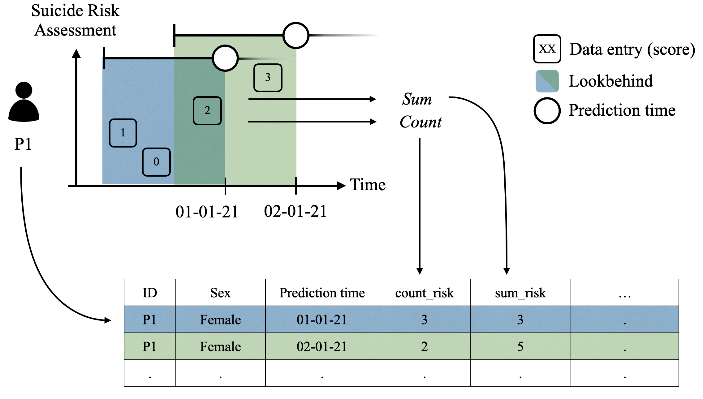

<a href="https://github.com/Aarhus-Psychiatry-Research/psycop-feature-generation"></a>


[][black]
[][tests]

[pypi status]: https://pypi.org/project/psycop-coercion/
[tests]: https://github.com/Aarhus-Psychiatry-Research/psycop-common/actions?workflow=Tests
[black]: https://github.com/psf/black

# CARE-ML: Predicting use of restraint on psychiatric inpatients using electronic health data and machine learning

This repository was developed as a part of the product Master’s Thesis in Cognitive Science by: 

Signe Kirk Brødbæk (201707519) and Sara Kolding (201708816)

## Table of Contents 
[1. Motivation](#motivation)

[2. Terminology](#terminology)

[3. Installation](#installation)

[4. Project Organization](#project_organisation)

[4.1 Module: Cohort Generation](#mod1)

[4.2 Module: Feature Generation](#mod2)

[4.3 Module: Model Training](#mod3)

[4.4 Module: Model Evaluation ](#mod4)


 <a id="motivation"></a>
## 1. Motivation
The use of three types of restraint, _physical_, _chemical_, and _mechanical_ restraint, has been increasing in Danish psychiatric units, despite the objective from the Ministry of Health and the Danish Regions to decrease the use of mechanical restraint, which can be seen in Figure 1 below. In recent years, In recent years, the literature on machine learning (ML) and prognostic prediction models in clinical contexts has expanded, including studies identifying individual patients at high risk of being coerced (Danielsen et al., 2019). By offering early detection of at-risk patients, such models could enable staff to reallocate resources to a subgroup of patients, to avoid coercive interventions.
   
For our thesis, we built this pipeline for training and evaluating prognostic supervised ML models for predicting the use of restraint on inpatients in the Central Denmark Region, building upon the study by Danielsen et al. (2019) and utilising the frameworks of the [timeseriesflattener](https://github.com/Aarhus-Psychiatry-Research/timeseriesflattener) package and the code base for the PSCYOP projects [psycop-common](https://github.com/Aarhus-Psychiatry-Research/psycop-common).


Our focus has been to build a tool that is sound and transparent, including evaluations to examine the relationship between the most important features and the outcome, as well as potential biases. Due to the sensitivity of the data infrastructures utilised in the current study, the packages are designed for very specific use cases within the department of psychiatry in CDR. As a consequence, the pipeline is intended for a small target audience, and not generalisable across other regions in Denmark or in other countries. 

The specific pipeline can be utilised and adapted for future research by researchers in the CDR. However, the framework and considerations implemented in this pipeline, such as the temporal considerations, evaluating on a held-out test set and thorough evaluation, is generalisable and can be utilised in other ML contexts. 

In the following sections, we will present 0) the terminology at the core of this pipeline, 1) how to install this package, 2) the project organisation, and 3) go through the functionality within each of module that allow future research to investigate additional hyperparameters and 

<a id="terminology"></a>
## 2. Terminology
We adopt the terminology used in the [timeseriesflattener](https://github.com/Aarhus-Psychiatry-Research/timeseriesflattener) package, which includes _lookbehind and lookahead windows_, and _aggregation functions_. 

### 2.1 Lookahead and lookbehind windows 
In A) below, the prediction time describes the time of prediction and acts as the reference point for the lookbehind and lookahead windows. The lookbehind window denotes how far back in time to look for feature values, while the lookahead window denotes how far into the future to look for outcome values. B) shows that when the outcome is found within the lookahead window, this constitutes a true positive within this framework. If the outcome occurs later than the lookahead window, this is a true negative


_Note. Visualisation of the timeseriesflattener terminology adapted from Bernstoff et al. (2023), reprinted with permission from the original authors_

In the current project, we utilise lookbehind windows of varying lengths (between 1 day and 730 days) to create features. The labels were created with a lookahead of 2 days/48 hours. 

<a id="aggf"></a>
### 2.2 Aggregation functions
When multiple feature values occur within a lookbehind window, there are several ways we can aggregate them. 
The figuer figure denotes how features can be "flattened" when multiple data entries exist within a lookbehind window. In the blue lookbehind, the three suicide risk assessments are completed and logged. These entries are aggregated into a tabular format by counting the number of risk scores and summing scores. Similarly, two scores appear in the green lookbehind window, which is also aggregated as the count of risk scores and the sum of scores. 



_Note. Figure developed in collaboration with the PSYCOP group._

The aggregation functions utilised in this project include: 
- Latest value
- Count
- Sum of hours
- Boolean
- Mean
- Maximum
- Minimum
- Change per day (slope of linear regression)
- Variance
- Concatenate (for text features)

<a id="installation"></a>
## 3. Installation

To install this repository, 

1) Clone this repo 
```
git clone https://github.com/Aarhus-Psychiatry-Research/psycop-restraint.git
```

2) Go to the project root and use the pyproject.toml to install dependencies: 
```
python -m pip install -e .
```
3) Install psycop-common as source 
```
python -m pip install -e .[src]
```
Depending on your terminal, you might have to add '' around .[scr]: 
```
python -m pip install -e '.[src]'
```

4) Optional: Install timeseriesflattener and psycop-common in your 'src' folder as their own repositories
```
pip install --src ./src -r src-requirements.txt
```

<a id="project_organisation"></a>
## 4. Project Organization

The project consist of the following overall structure, including four modules for 1) cohort generation, 2) feature generation, 3) model training, and 4) model evaluation. In the following sections, we will delineate the functionality of each module. 

    ├── README.md
    │
    ├── docs
    │
    ├── src                      <- Source code for use in this project.
    │   ├── __init__.py          
    │   │
    │   ├── cohort_generation    <- Module for creating the cohort wih labels
    │   │
    │   ├── feature_generation   <- Module for feature generation
    │   │
    │   ├── model_evaluation     <- Module for model evaluation
    │   │
    │   ├── model_training       <- Module for model training
    │
    ├── pyproject.toml           <- Poetry file handling all dependendencies
    │ 
    └── Other configuration files

<a id="mod1"></a>
## 4.1 Module 1: Cohort Generation 

First, the cohort was defined with the following inclusion/exclusion criteria: 

1. The patient had a minimum of one psychiatric admission which started between 1 January 2015 and 22 November 2021.
2. The patient was >= 18 years at the time of admission.
3. The patient experienced no instances of physical, chemical, or mechanical restraint in the 365 days before the admission start date. 

Then, target days were defined as: 

1. Either physical, chemical, or mechanical restraint occuring within 48 hours of the time of prediction
3. Days after the first outcome instance was excluded, only 11.68% of admission with coercion in the PSYCOP cohort have only one instance of restraint), and predicting days after the first outcome offers less information to healthcare professionals. 
4. Prediction days after mean admission length + 1 standard deviation (mean=16 days, sd=44 days, cut-off = 60 days) was excluded to remedy the imbalance in classes.

As discussed in the thesis, these criteria could influence model prediction and clinical applicability. Within this module, you can change these criteria.

In this module, admissions start out as being one row and is unpacked to include 1 row per day in the admission with the prediction time, excluding the first admisison day if it is after the prediction time of the current day and the last admission day if the patient is discharged before the time of prediction.

See example below with the unpacking of an admission, where the time of prediction 6:00 a.m. and lookahead is 48 hours.  

Note: 
- The fifth/last day of admisision is removed, since days after the outcome is removed 
- Since the lookahead is 48 hours, two days are denoted target days (outcome = 1)

Before: 
| adm_id | patient_id | admission_timestamp | discharge_timestamp |  outcome_timestamp   |
| :----- | :--------- | :------------------ | :------------------ |  :-----------------  |
| 1      |     1      | 2021-01-01 05:00:00 | 2021-01-05 16:00:00 |  2021-01-04 16:33:00 |


After: 
| adm_id | patient_id | admission_timestamp | discharge_timestamp |  outcome_timestamp   | prediction_timestamp | admission_day_counter | outcome | 
| :----- | :--------- | :------------------ | :------------------ |  :-----------------  | :------------------- | :-------------------- | :-----  |
| 1      |     1      | 2021-01-01 05:00:00 | 2021-01-05 16:00:00 |  2021-01-04 16:33:00 | 2021-01-02 06:00:00  |  1                    |  0      |
| 1      |     1      | 2021-01-01 05:00:00 | 2021-01-05 16:00:00 |  2021-01-04 16:33:00 | 2021-01-02 06:00:00  |  2                    |  0      |
| 1      |     1      | 2021-01-01 05:00:00 | 2021-01-05 16:00:00 |  2021-01-04 16:33:00 | 2021-01-03 06:00:00  |  3                    |  1      |
| 1      |     1      | 2021-01-01 05:00:00 | 2021-01-05 16:00:00 |  2021-01-04 16:33:00 | 2021-01-04 06:00:00  |  4                    |  1      |

<a id="mod2"></a>
## 4.2 Module: Feature Generation

In this module, the cohort is linked to other variables to create features based on the defined lookbehind windows and aggregation functions, using the _timeseriesflattener_ package and data loaders from the _psycop-commn_ package. 

_timeseriesflattener_ was created to handle data from electronic health records, which might have many missing values and are sampled irregularly. By defining windows to look for values and how such values should be aggregated, _timeseriesflattener_ *flattens* the data, as described in Section [2. Terminology](#terminology). 

In addition to aggregation functions, a _fallback_, i.e. a value to insert when no observations is found within a window, is chosen. We used fallbacks of 0 (e.g., for hospital contacts) and NA (for texts and structured SFI's where a 0 score is different from a missing value). 

If we use the example in the figure in the Figure in [Section 2.2](#aggf), the lookbehind window is 2 days, with three suicide risk assessment scores within the first (blue) lookbehind and two risk scores within the second (green) lookbehind. The data entries can be aggregated in multiple ways. Here, we aggregate them by counting the number of contacts and summing the hours of contacts. The fallback is set to NA, since a score of 0 is meaningful for this score. 

The features are appended on the cohort dataframe with one admission from the previous example: 

Suicide risk assessment dataframe: 
| patient_id | risk_timestamp      | Score  |  
| :--------- | :------------------ | :----- | 
|     1      | 2020-12-30 10:00:00 | 2 |
|     1      | 2021-12-30 10:00:00 | 0 |
|     1      | 2021-12-31 10:00:00 | 2 |
|     1      | 2021-01-01 10:00:00 | 3 |


Appended to the cohort dataframe: 
| adm_id | patient_id | admission_timestamp | discharge_timestamp |  outcome_timestamp   | prediction_timestamp | admission_day_counter | outcome | pred_risk_within_2_days_count | pred_risk_within_2_days_sum |
| :----- | :--------- | :------------------ | :------------------ |  :-----------------  | :------------------- | :-------------------- | :-----  | :---- | :---- |
| 1      |     1      | 2021-01-01 05:00:00 | 2021-01-05 16:00:00 |  2021-01-04 16:33:00 | 2021-01-01 06:00:00  |  1                    |  0      | 3     |   3   |
| 1      |     1      | 2021-01-01 05:00:00 | 2021-01-05 16:00:00 |  2021-01-04 16:33:00 | 2021-01-02 06:00:00  |  2                    |  0      | 2     |   5   |  
| 1      |     1      | 2021-01-01 05:00:00 | 2021-01-05 16:00:00 |  2021-01-04 16:33:00 | 2021-01-03 06:00:00  |  3                    |  1      | 1     |   3   |
| 1      |     1      | 2021-01-01 05:00:00 | 2021-01-05 16:00:00 |  2021-01-04 16:33:00 | 2021-01-04 06:00:00  |  4                    |  1      | 0     |   0   |

In this module, a variety of loaders (loading data from the data infrastructure used in CDR, for users with access) can be utilised. Among others, it is possible to create features based on demographics, medication, coercion, hospital contacts, and assessment scores ("Sundhedsfagligt Indhold, SFIs). Features based on unstructured text can also be created with this module. 

For the thesis project, we created two feature sets using this module: 
- A _baseline_ feature set solely consisting of features based on structured data 
- A _text-enhanced_ feature set consisting of features based on bag-of-words and TF-IDF* weighting along with the baseline features

After the feature were generated, the features are split into a training dataset and a held-out test set. We used a 85%-15% split. 

*TF-IDF: Term frequency-inverse document frequency 

<a id="mod3"></a>
## 4.3 Module: Model Training 

We used two model types: elastic net logistic regression and XGBoost. Both were trained using 5-fold cross-validation, with a hyperparameter search including tuning of various preprocessing parameters, predictor selection methods, and model hyperparameters. 
The search was run on a server 30-core Intel Xeon CPU, 512GB of RAM and an NVIDIA A100 GPU, and was concluded when each of the four models had been cross-validated 300 times with various configurations of hyperparameters. 
It would not be feasible to run such a search on a local computer. However, it is possible to run a single model to see the pipeline using the script _train_model_from_application.py_. 

This module is set up with several configs (see folder _config_ ) which allows the user to set several parameters. For example, which data, preprocessing steps, models, and training procedures to use. 

The project i set up to be run using Weights and Biases (WandB) to create visualisations of the hyperparameter tuning process. However, due to a shutdown of the internet connection from the server we used, this was not doable for search conducted for the thesis project. 

Example of a WandB visualisation of a hyperparameter search for XGBoost: 


<a id="mod4"></a>
## 4.4 Module: Model Evaluation 

After the models had been trained, they were evaluated on a held-out test set, comprising 15% of the cohort, using the Model Evaluation module. 
This modules mostly constitues visualisations of performance, robustness across different splits (sex, age groups, and time), as well as feature importance. 

In the application/pipelines subfolder, the user can find pipelines for producing the different figures. 

AUROC and AUPRC figures as well as confusion matrices as the ones shown below can be created using the performance pipelines in the folder found at: application/pipelines/performance. 


SHAP figures, showing the mean absolute shap values for the top X features can be created used the pipeline: application/pipelines/feature_importance/shap_summary_pipeline.py. 

See example below: 


Within this module, thorough evaluation, vital for clinical ML models, can be conducted. It is possible to calculate important evaluation metrics and visualise performance in various manners. 

Furthermore, it is possible to visualise the top features based on mean absolute SHAP, as well as Information Gain. 

Moreover, this moduel allows the user to visualise SHAP dependency plots for individual features. Due to the sensitivity of our data, we could not utilise dependency plots, since it would show individual scores which could jeopardise patient anonymity. 


## 🎓 Sources 

Danielsen, A. A., Fenger, M.H.J., Østerggard, S.D., Nielbo, K.L., & Mors, O. (2019). Predicting mechanical restraint of psychiatric inpatients by applying machine learning on electronic health data. Acta Psychiatrica Scandinavica, 147–157. https://doi.org/10.1111/acps.13061
